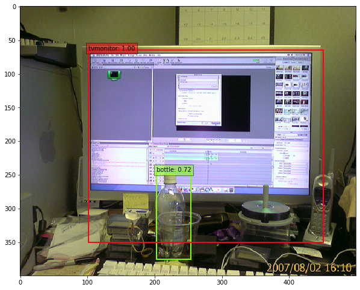
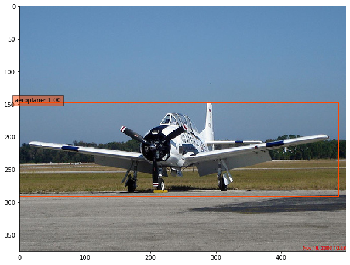
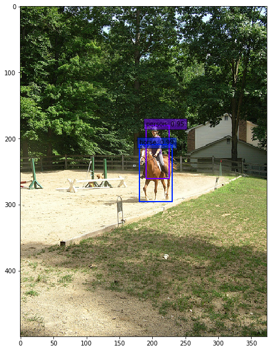

# SSD: Single Shot MultiBox Object Detector
Code modified from [ssd.pytorch](https://github.com/amdegroot/ssd.pytorch).

## Evaluation 
Evaluation performed on PASCAL VOC 2012 dataset.
Categories | AP 
:---: | :---: |
aeroplane | 0.7818
bicycle | 0.7200
bird | 0.6477
boat | 0.4651
bottle | 0.3866
bus | 0.7714
car | 0.6852
cat | 0.8264
chair | 0.4571
cow | 0.6483
diningtable | 0.5567
dog | 0.7803
horse | 0.7255
motorbike | 0.7716
person | 0.7421
pottedplant | 0.3492
sheep | 0.6679
sofa | 0.5870
train | 0.7815
tvmonitor | 0.6457
**Mean AP** | **0.6499**

## Examples

## References
- Wei Liu, et al. "SSD: Single Shot MultiBox Detector." [ECCV2016]((http://arxiv.org/abs/1512.02325)).
- [Original Implementation (CAFFE)](https://github.com/weiliu89/caffe/tree/ssd)
- https://github.com/amdegroot/ssd.pytorch